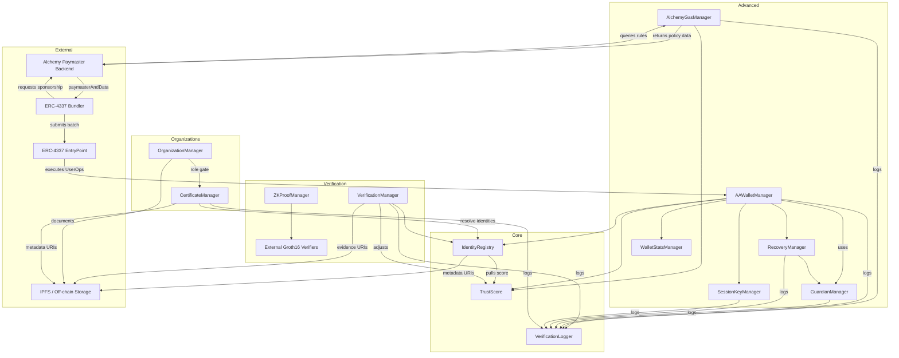

# DID Smart Contract & ZKP Analysis Guide (2025)

This guide provides a comprehensive, up-to-date map of the Solidity contracts and zero-knowledge proof (ZKP) flows in this repository. It details the architecture, contract responsibilities, dependencies, and runtime flows, and includes a visual flow chart for quick reference. All legacy governance/dispute modules have been removed or retired; this guide reflects the current, dispute-free system.

---

## How to Use This Guide

1. **Follow the reading sequence** – it starts with the minimal primitives and climbs toward higher-level features.
2. **Track dependencies** – every subsection lists the critical contracts it talks to so you can open tabs in parallel.
3. **Keep the flow chart handy** – it captures the runtime wiring between components.

---

## Step 0 – Shared Building Blocks (`src/libs` & `src/interfaces`)

Start with the domain types, error helpers, and interfaces so Solidity signatures are familiar before touching stateful contracts.

| File | Purpose | Notable Members | Referenced By |
| --- | --- | --- | --- |
| `libs/Errors.sol` | Custom errors for gas savings and clarity. | `NotAuthorized`, `InvalidInput`, etc. | All managers and modules |
| `libs/Roles.sol` | Canonical `bytes32` role constants. | `SYSTEM_ADMIN`, `VERIFICATION_PROVIDER`, etc. | All AccessControl contracts |
| `libs/IdentityTypes.sol` | Identity storage structs/enums. | `IdentityStatus`, `IdentityProfile` | `IdentityRegistry`, `VerificationManager` |
| `libs/VerificationTypes.sol` | Verification metadata and helpers. | `VerificationRecord`, template ID helpers | `VerificationManager` |
| `libs/OrganizationTypes.sol` | Organization data model. | `Organization`, `OrganizationStatus` | `OrganizationManager` |
| `libs/ZkTypes.sol` | Canonical proof type IDs for ZK circuits. | `ageGte`, `attrEquals`, etc. | `ZKProofManager`, AA wallet policies |

**Key interfaces:**
`IIdentityRegistry.sol`, `ITrustScore.sol`, `IVerificationLogger.sol`, `IVerificationManager.sol`, `IZKProofManager.sol`, `IGroth16Verifier.sol`, `IOrganizationManager.sol`, `IGuardianManager.sol`, `IRecoveryManager.sol`, `ISessionKeyManager.sol`, `IWalletStatsManager.sol`.

> 📌 **Why first?** Having the types and interfaces in mind makes the contracts’ storage layouts and access patterns much easier to absorb.

---

## Step 1 – Core Identity Backbone (`src/core`)

| Contract | Purpose | Key Functions | Depends On |
| --- | --- | --- | --- |
| `VerificationLogger.sol` | Central audit log; role-gated event emitter. | `logEvent`, `grantLoggerRole`, `revokeLoggerRole` | OpenZeppelin `AccessControl`; all modules write to it |
| `TrustScore.sol` | Global reputation ledger keyed by identity ID. | `increaseScore`, `decreaseScore`, `setScore`, `getScore` | `Roles` for auth, emits events for off-chain analytics |
| `IdentityRegistry.sol` | Canonical identity store. Maps owners ⇄ identity IDs, enforces status. | `registerIdentity`, `setIdentityStatus`, `updateMetadata`, `getIdentity`, `resolveIdentity`, `setTrustScoreContract` | `TrustScore`, `Roles` |

> ✅ **Reading target:** Understand how identities are minted, how status gates everything downstream, and how trust score adjustments propagate.

---

## Step 2 – Verification & ZKP Layer (`src/verification`)

| Contract | Purpose | Core Functions | Dependencies |
| --- | --- | --- | --- |
| `VerificationManager.sol` | Records verifications from approved providers, updates trust scores, manages provider registry. | `registerProvider`, `setProviderStatus`, `recordVerification`, `setVerificationStatus`, `getVerification`, `getProvider` | `IdentityRegistry` (checks subject status), `TrustScore` (rewards/penalties), `VerificationTypes`, `Roles` |
| `ZKProofManager.sol` | Registry & router for Groth16 ZK proof verifiers; manages root anchoring and nullifier replay protection. | `addProofType`, `updateProofType`, `anchorRoot`, `revokeRoot`, `verifyProof`, `verifyAgeProof`, `verifyIncomeProof`, etc. | `IGroth16Verifier` contracts, `ZkTypes`, internal root/nullifier tracking |

**ZKP flow essentials:**
1. Admins register proof verifiers via `addProofType`.
2. Off-chain services anchor Merkle roots with `anchorRoot`.
3. End-users submit Groth16 proofs; `verifyProof` checks root validity, ensures nullifier uniqueness, and delegates to the correct verifier contract.
4. Consumers (AA wallet policies, dApps) call `verifyAgeProof`, `verifyIncomeProof`, etc., for ready-made templates.

---

## Step 3 – Organizations (`src/organizations`)

| Contract | Purpose | Key Functions | Linked Components |
| --- | --- | --- | --- |
| `OrganizationManager.sol` | Registers and maintains organization metadata and per-org role assignments. | `registerOrganization`, `setOrganizationStatus`, `assignRole`, `revokeRole`, `updateOrganizationMetadata`, `getOrganization`, `hasOrganizationRole` | `OrganizationTypes`, `Roles`, `Errors` |
| `CertificateManager.sol` | Lets active organizations mint and revoke ERC-721 certificates (NFTs) for identities they’ve verified. Enforces per-organization issuer roles and logs activity. | `issueCertificate`, `revokeCertificate`, `getCertificate` | `OrganizationManager` (role checks), `IdentityRegistry` (identity resolution), `VerificationLogger` (audit trail) |

> 🔎 While currently standalone, expect future hooks into trust scoring or verification gating. Role-setting patterns mirror identity admin design.

> ℹ️ **Legacy governance components (e.g., dispute resolution) have been fully retired and are not present in this architecture.**

---

## Step 4 – Advanced & Account Abstraction (`src/advanced_features`)

These contracts extend the identity layer with ERC-4337-inspired wallet stack, gas sponsorship, guardian recovery, and observability.

| Contract | Responsibility | Key Functions | Depends On |
| --- | --- | --- | --- |
| `GuardianManager.sol` | Maintains guardian sets per owner for social recovery. | `setGuardians`, `addGuardian`, `removeGuardian`, `isGuardian`, `getGuardians` | `VerificationLogger`, `AccessControl` |
| `RecoveryManager.sol` | Orchestrates guardian-driven recovery requests with thresholds and delays. | `requestRecovery`, `confirmRecovery`, `executeRecovery`, `cancelRecovery` | `GuardianManager`, `VerificationLogger` |
| `SessionKeyManager.sol` | Issues scoped session keys for delegated actions. | `addSessionKey`, `revokeSessionKey`, `isSessionKeyValid`, `getSessionKeys`, `getSessionKeyConfig` | Only callable by owning AA wallet manager; logs via `VerificationLogger` |
| `WalletStatsManager.sol` | Tracks UserOperation statistics for wallets. | `recordUserOp`, `getStats` | No external dependencies; owned by AA wallet manager |
| `AlchemyGasManager.sol` | Gas sponsorship policy engine with trust-score thresholds and onboarding allowances. | `shouldSponsorGas`, `getPaymasterData`, `recordGasSponsorship`, `updateSponsorshipRule`, `setOnboardingSettings`, `setWhitelist` | Reads `TrustScore`, emits to `VerificationLogger` |
| `AAWalletManager.sol` | High-level orchestrator: CREATE2 wallet deployment, ERC-4337 UserOp validation, guardian recovery, session keys, stats, trust limits. | `createWallet`, `deployWallet`, `executeUserOp`, `requestRecovery`, `updateWalletSettings`, `addSessionKey` | Integrates with all above advanced modules, `IdentityRegistry`, `TrustScore`, `VerificationLogger` |

> ⚙️ **Reading tip:** Work through `AAWalletManager` last in this tier; it references every other advanced feature.

---

## Step 5 – Pulling It Together

### Recommended Reading Order Recap

1. Libraries & Interfaces (all files in `src/libs` and `src/interfaces`)
2. `VerificationLogger.sol` → `TrustScore.sol` → `IdentityRegistry.sol`
3. `VerificationManager.sol` → `ZKProofManager.sol` (provider vs. ZKP flows)
4. `OrganizationManager.sol` → `CertificateManager.sol`
5. Advanced features: `GuardianManager.sol`, `RecoveryManager.sol`, `SessionKeyManager.sol`, `WalletStatsManager.sol`, `AlchemyGasManager.sol`, finishing with `AAWalletManager.sol`

### Key Runtime Flows to Trace

- **Identity lifecycle:** Admin registers identity → verification providers attach verifications → trust score adjusts → downstream modules check status/score before allowing operations
- **ZKP verification:** Roots anchored in `ZKProofManager` → Groth16 proof checked → nullifier marked → consumer contract acts on boolean result
- **AA wallet recovery:** Guardians configured → recovery request opened in `RecoveryManager` → confirmations collected → `AAWalletManager` swaps ownership after delay
- **Gas sponsorship:** DApp or bundler queries `AlchemyGasManager.shouldSponsorGas` → rule evaluated using trust score and usage data → paymaster decision returned, optionally adjusting trust on fulfillment
- **Off-chain coordination:** Bundlers compose `UserOperation`s, obtain paymaster data from the sponsorship backend (which in turn queries on-chain policy), and submit the batch to the ERC-4337 EntryPoint that ultimately triggers the AA wallet; metadata and evidence URIs point to IPFS or similar decentralized storage
- **Organization-issued credentials:** Org admin registers and is activated → assigns `ORGANIZATION_ISSUER` role to trusted staff → issuer mints via `CertificateManager`, which checks identity registration, logs to `VerificationLogger`, and stores metadata URIs (typically IPFS-backed)

---

## System Connectivity Flow Chart (2025)

> 🗺️ Use the chart to jump between files whenever you encounter an external call or interface reference.

---

## Security & Audit Checklist (2025)

When reviewing each contract, tick through:

- Access control surface: who can mutate state? Do role grants cascade correctly?
- Trust score side-effects: every score change should emit context-rich reasons for off-chain analytics.
- Reentrancy and replay: especially in `AAWalletManager`, `RecoveryManager`, and `ZKProofManager` (nullifiers!).
- Proof anchoring hygiene: verify how roots are added, revoked, and timestamped before trusting them downstream.
- Guardian workflows: ensure recovery thresholds (`RecoveryManager`) align with the fixed guardian count (`GuardianManager`).
- Gas sponsorship limits: monitor daily/monthly counters in `AlchemyGasManager` for overflow or front-running vectors.

---

Happy hacking! Keep this document synced with code changes whenever contracts or roles evolve. For the most up-to-date contract/module details, always refer to this guide and the README.